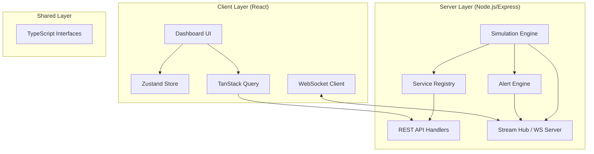

# Architecture: Pulse Service Health Dashboard

## 1. Overview
Pulse is a real-time observability platform designed to monitor service health, performance metrics, and operational alerts across a distributed infrastructure. Built with **React 18** and **Tailwind CSS 4**, the system follows a **Backend-for-Frontend (BFF)** pattern to provide optimized data delivery for the web dashboard.

### Key Goals
- **Real-time Visualization**: Minimal latency between metric generation and UI updates.
- **Scalable Monitoring**: Efficiently handling telemetry from hundreds of simulated services.
- **Operational Intelligence**: Automated alert generation based on performance thresholds.

---

## 2. System Architecture

---

## 3. Core Components

### 3.1 Backend Simulation Engine
The server runs a periodic simulation loop (every 3s) that mimics a live production environment:
- **Metric Generation**: Calculates p50, p95, and p99 latencies using controlled randomness to simulate traffic spikes and steady states.
- **State Transition**: Services transition between `healthy`, `degraded`, and `down` based on error rates and latency thresholds.
- **Alert Pipeline**: Evaluation of metric thresholds (`errorRate > 5%`, `p99 > 2000ms`) to trigger incidents.

### 3.2 Real-time Telemetry (Stream Hub)
Real-time updates are pushed via **WebSockets** (`/api/stream`):
- **Event-Driven**: The server broadcasts `metric_update`, `alert_created`, and `status_change` events.
- **Efficiency**: Only delta changes are transmitted to reduce bandwidth consumption.

### 3.3 Frontend Architecture Patterns
- **Layout Separation**: Global layout logic (Header/Footer/Banner) is decoupled from functional views via the `AppLayout` component.
- **State Management Strategy**:
    - **Server State**: Managed by `TanStack Query` for caching, revalidation, and background fetching of historical data.
    - **Client/UI State**: Managed by `Zustand` for lightweight, cross-component state like filters and selections.
- **Real-time Syncing**: The `useStream` hook integrates WebSocket events directly into the application lifecycle, invalidating queries or updating local state as needed.

---

## 4. Data Models

The system is built around four primary entities defined in the `@shared/types`:

1.  **Service**: Represents a monitored unit (Microservice, Database, etc.) with metadata like `tier` and `group`.
2.  **MetricDataPoint**: A snapshot of performance at a point in time (latency percentiles, request rate, error rate).
3.  **Alert**: An incident record triggered by performance anomalies.
4.  **DashboardSummary**: Aggregated system-wide health statistics.

---

## 5. Design Decisions & Patterns

### 5.1 BFF (Backend-for-Frontend)
Instead of the client interacting with raw data sources, the Node.js server aggregates and transforms data into the exact shape required by the dashboard, reducing client-side processing.

### 5.2 Error Boundaries & Resiliency
Strategic use of `ErrorBoundary` components around critical panels (Health Lattice, Performance Curve) ensures that a failure in one data source doesn't crash the entire dashboard.

### 5.3 Feature Flagging
A centralized `FeatureFlag` component allows for controlled rollout of complex UI modules like the "Dependency Map" without impacting core stability.

### 5.4 Theme System
Uses `next-themes` with Tailwind CSS 4 variables to provide a high-performance, system-aware dark/light mode with zero-runtime CSS variables.

---

## 6. Future Scalability
- **Persistence**: Currently in-memory; can be extended to Redis/PostgreSQL for long-term historical analysis.
- **Multi-Region**: The architecture supports a `region` field in service metadata to enable global observability views.
- **Auth/RBAC**: Ready for integration with OIDC/JWT providers at the BFF layer.
